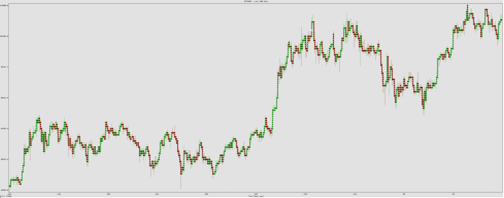

# Binance Candles Script - Fetches cryptocurrency candle data from Binance API

## USAGE
1. Activate the virtual environment:
   source venv/bin/activate

2. Install dependencies (if not already installed):
   pip install requests plotext

3. Run the script:
   python terminal_chart.py [OPTIONS]

## OPTIONS
- --symbol SYMBOL     Trading pair symbol (default: BTCUSDT)
- --interval INTERVAL Candle interval: 1m, 3m, 5m, 15m, 30m, 1h, 2h, 4h, 6h, 8h, 12h, 1d, 3d, 1w, 1M (default: 1m)
- --limit LIMIT       Number of candles to fetch (default: 100, max: 1000)
- --night             Enable night mode for better terminal visibility
- --once              Run once and exit (default: continuous mode)

## EXAMPLES
- python terminal_chart.py --symbol ETHUSDT --interval 1h --limit 50
- python terminal_chart.py --night --symbol ADAUSDT --interval 15m
- python terminal_chart.py --once

The script runs continuously and refreshes data at appropriate intervals:
- For minute intervals: refreshes every minute at :00 seconds
- For hour intervals: refreshes every hour at :00 minutes
- For day intervals: refreshes every day at 00:00